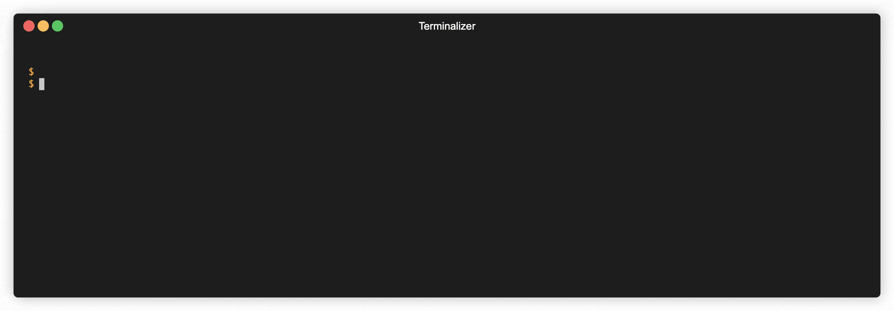

# 👌 Helm Values Validator (pour faire un exemple de hook helm)

**Outil de validation de format de valeurs Helm**

Cet outil vous permet de valider le format de vos valeurs Helm à l'aide d'un [JSONSchema](https://json-schema.org/) avec
les hooks Helm `pre-install` & `pre-upgrade`. Comme [Schema Files](https://helm.sh/docs/topics/charts/#schema-files)

[](https://helm.sh/docs/)
[](https://json-schema.org/)
[](https://github.com/GoogleContainerTools/distroless)

*[French Readme](./README-FR.md) - [English Readme](./README.md)*

> **Fonctionnalités**
> * Validation du format des valeurs Helm
> * Affichage des messages d'erreur en cas de problème
> * Exécution manuelle possible



---

## 🚀 Installation

1. Copier le fichier `exemple/templates/tests/helm-values-validator.yaml` dans votre stack Helm.
2. Ajouter votre `schema.json` à la racine de votre chart Helm (même niveau que le `values.yaml`).
3. Installer le chart Helm avec la commande `helm install`.
4. (Optionnel) Convertir votre fichier `values.yaml` en `JSONSchema`
   sur  [jsonformater.org](https://jsonformatter.org/yaml-to-jsonschema)

## 📝 Logs

Pour voir les messages d'erreur de validation, vous pouvez utiliser les commandes suivantes :

```shell
# Les logs
kubectl logs nom-de-la-release-helm-values-validator

# Les messages d'erreur
kubectl get pod -n demo-test test-demo-helm-values-validator -o go-template="{{range .status.containerStatuses}}{{.state.terminated.message}}{{end}}"
```

## 🧑‍🔧 Exécution manuelle

Si vous voulez exécuter la validation sans lancer d'installation Helm, vous pouvez exécuter le conteneur avec les
fichiers et variables comme dans la commande suivante :

```bash
docker run -it -v $(pwd)/values.json:/values.json -v $(pwd)/schema.json:/schema.json -e SCHEMA_FILE=/schema.json -e VALUES_FILE=/values.json franckrst/helm-values-validator:0.0.0-alpha
```

## 📐 Architecture

Simple hook Helm pre-install et pre-upgrade qui déploie :

- Une ConfigMap qui comporte le fichier schema.json et un fichier values.json qui comporte la variable .Values
- Un Pod qui lance le conteneur de validation dans lequel est montée la ConfigMap

## Licence

MIT

## Thx

- [Github Action multiarch docker](https://dev.to/cloudx/multi-arch-docker-images-the-easy-way-with-github-actions-4k54)

